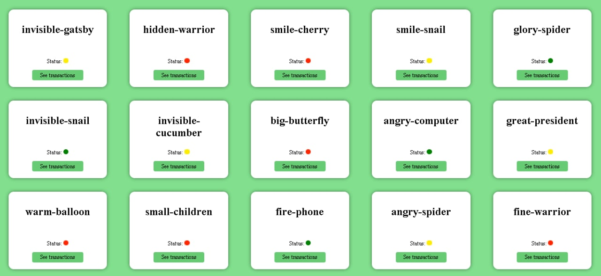
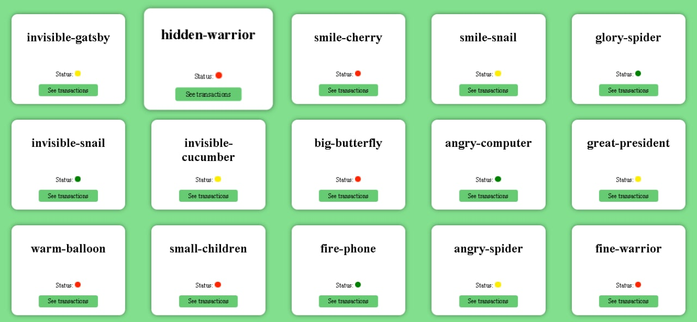

# This is API Open-Source free-to-use resource which helps you to practice.
## API Documentation 
https://documenter.getpostman.com/view/10440411/UVXokDWV
## Endpoint to testing 
https://user-transaction-fetch-api.herokuapp.com
## Example of usages
1. React
   1. Classic View
        
   2. Hover action 
        